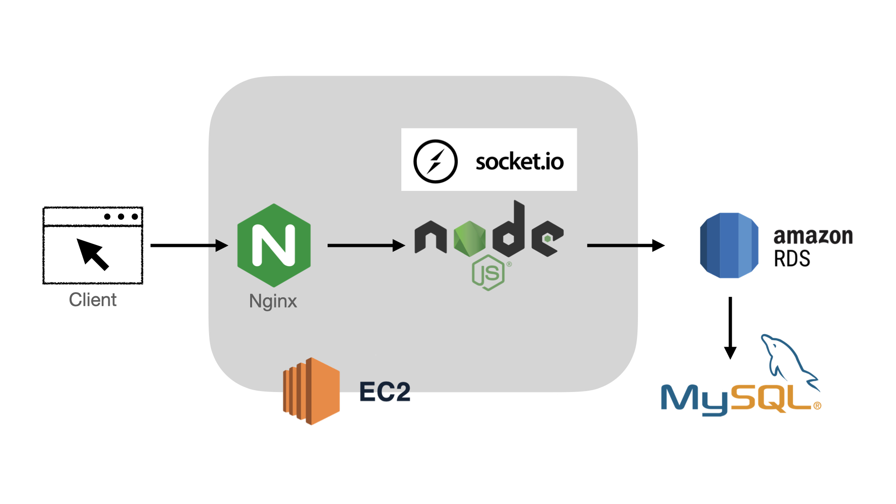
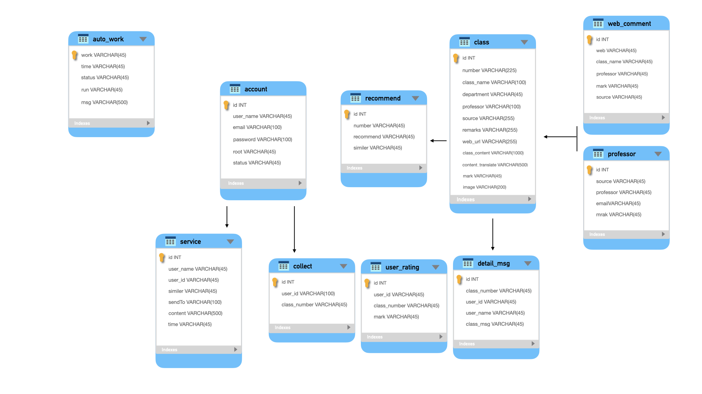
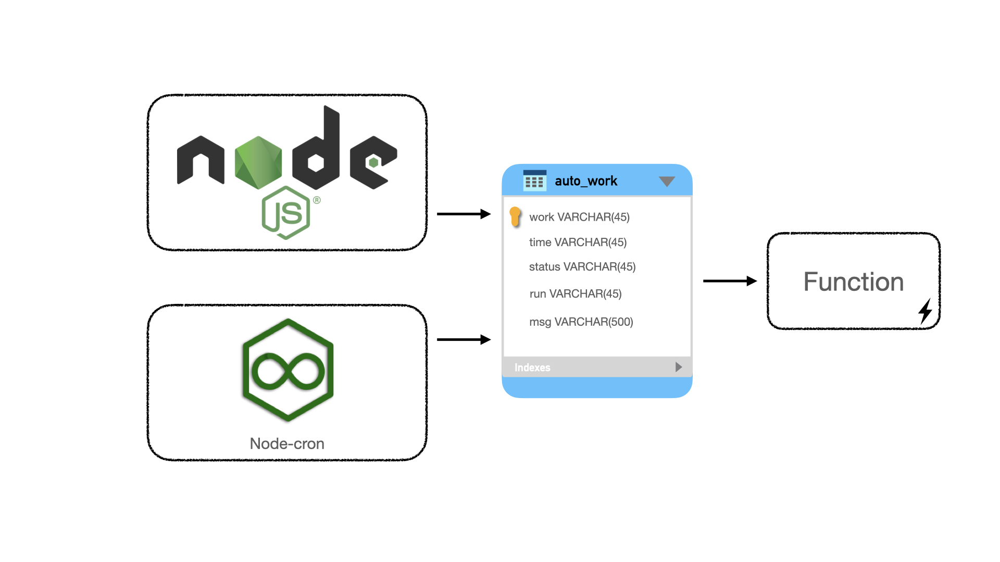

# PangTing

Pangting centralizes course information from National Taiwan University and online learning platform Coursera. 

# table of Contents

* [Technologies](#technologies)
* [Structure](#structure)
* [Database design](#database-design)
* [Technique](#technique)

# Technologies

**Design Concept**
* MVC
* RESTful API

**Language**
* SQL
* JavaScript
* C++

**Back-End**
* Node.js
* Express
* Framework

**Front-End**
* HTML
* CSS

**Tool**
* Linux
* Line bot
* Discord bot
* Chrome extension
* Git/GitHub

# Structure

# Database design

# Features

**Features ready**

* Course info
    * Course detail
        * name
        * department
        * professor
        * content
        * source

    * Course recommend
        * top 10 similar course 
    * Course mark
    * other user message

* Course interaction
   * Grade the course
   * add collect
   * leave comments and delete it

* admin account
    * control web crawler
    * Management courses
    * Supervise all account
    * Review message

* To-do features
    * Front-end optimization
    * Databases optimization
    * Insert more universities

# Special Technique

* recommend
    * model: TF-IDF
    * date: course content
    * difficult: The class language are different, Before recommend, have to using google-translate api to unified language, that spent lot of time. Recommend courses are spent lot of time too. O(n) + 10*O(n)^2

* web crawler
    * tool: fetch, cheerio
    * method: API, HMTL

* auto execution
    * control: Databases, express API, node-corn
    * Use node-corn automatic start function to update courses. From client admin account can use api to control datebases, when function are runing it will keep listen databases status.
